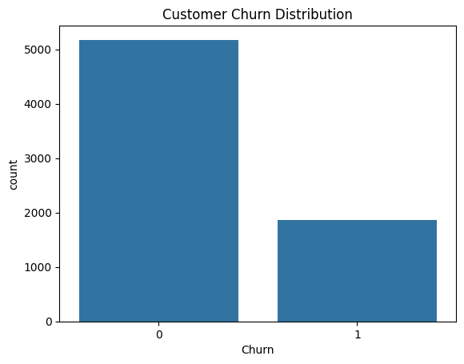
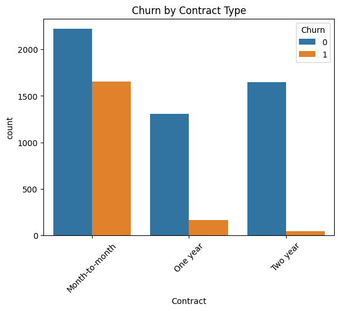
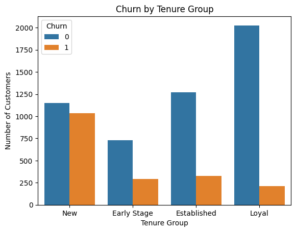

# Customer Retention & Churn Analysis

## Project Overview
This project analyzes customer churn behavior using a telecom dataset. The objective is to identify key drivers of customer attrition and develop insights that can support business decisions aimed at improving customer retention.

---

## Objectives
- Identify factors influencing customer churn
- Analyze customer behavior patterns
- Segment customers based on risk and value
- Build a predictive model to estimate churn likelihood
- Provide actionable business recommendations

---

## Tools & Technologies
- Python (Pandas, NumPy)
- Data Visualization (Matplotlib, Seaborn)
- Machine Learning (Scikit-learn)
- Jupyter Notebook

---

# Dataset
The dataset includes customer demographic information, service usage, billing details, and churn status.

Key features:
- Customer tenure
- Contract type
- Monthly charges
- Payment method
- Internet service type

---

## Key Insights
- Customers with shorter tenure have significantly higher churn rates
- Month to month contracts are strongly associated with higher churn
- High value customers show higher churn, representing a major revenue risk
- Electronic check users and fiber optics customers exhibit higher churn patterns

---

## Key Visualizations

### Churn Distribution

### Churn by Contract Type

### Churn by Tenure Group

---

## Feature Engineering
Ceating meaningful customer segments:
- Tenure groups (New, Early Stage, Estabkished, Loyal)
- Value segments (LOw, Medium, High)
- Risk segments based on behavioral indicators
- strategy segments combining risk and value for prioritization

---

## Model Summary

A Logistic Regression model was developed to predict customer churn:
- Accuracy: ~81%
- Strong performance for non-churn prediction
- Moderate recall for churned customers

---

## Business Recommendations

- Improve onboarding experience to reduce early churn
- Encourage long-term contracts through incetives
- Focus retention efforts on high-value, high-risk customers
- Review pricing and service quality for premium offerings

---

## Limitations

- Moderate recall for churn prediction
- Static dataset may not reflect real-time changes

---

## Next Steps

- Improve model performance using advanced algorithms
- Enhance feature engineering
- Integrate insights into dashboards or business tools

---

## Author
Lusanda Nodongwe
